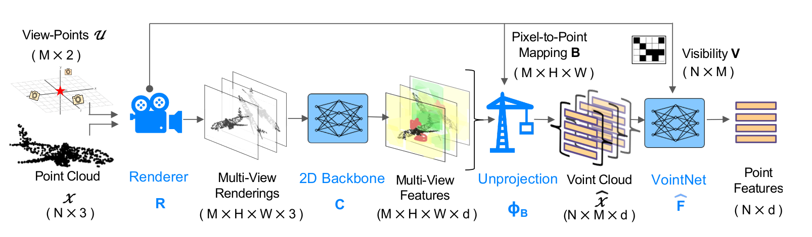

# Voint Cloud (ICLR'23)
---
Webpage for paper [Voint Cloud: Multi-View Point Cloud Representation for 3D Understanding](arxiv.org/abs/2111.15363)

By [Abdullah Hamdi](https://abdullahamdi.com/), [Silvio Giancola](https://www.silviogiancola.com/), [Bernard Ghanem](http://www.bernardghanem.com/)
### [Paper](https://arxiv.org/pdf/2111.15363.pdf) | Video | Tutorial . <br>

<br>

**Code is integrated into [MVTorch](https://github.com/ajhamdi/mvtorch) library**.

**Open an issue in https://github.com/ajhamdi/mvtorch if you have question regards to Voint Cloud**. 

### Citation
If you are using our code in your work, please kindly cite the following:  
```
@inproceedings{hamdi2021voint,
  title={Voint Cloud: Multi-View Point Cloud Representation for 3D Understanding},
  author={Hamdi, Abdullah and Giancola, Silvio and Ghanem, Bernard},
  booktitle={International Conference on Learning Representations},
  year={2023}
}
``` 

---
**Voint Cloud: Multi-View Point Cloud Representation for 3D Understanding**

By [Abdullah Hamdi](https://abdullahamdi.com/), [Silvio Giancola](https://www.silviogiancola.com/), [Bernard Ghanem](http://www.bernardghanem.com/)
### [Paper](https://arxiv.org/pdf/2111.15363.pdf) | Video | Tutorial . <br>

<br>

<p float="center">

</p>
**TL;DR:** We propose voint cloud, a novel 3D data structure, that combines multi-view and point clouds for robust 3D understanding tasks. 


**Abstract**: 
Multi-view projection methods have demonstrated promising performance on 3D understanding tasks like 3D classification and segmentation. However, it remains unclear how to combine such multi-view methods with the widely available 3D point clouds. Previous methods use unlearned heuristics to combine features at the point level. To this end, we introduce the concept of the multi-view point cloud (Voint cloud), representing each 3D point as a set of features extracted from several view-points. This novel 3D Voint cloud representation combines the compactness of 3D point cloud representation with the natural view-awareness of multi-view representation. Naturally, we can equip this new representation with convolutional and pooling operations. We deploy a Voint neural network (VointNet) to learn representations in the Voint space. Our novel representation achieves \sota performance on 3D classification, shape retrieval, and robust 3D part segmentation on standard benchmarks ( ScanObjectNN, ShapeNet Core55, and ShapeNet Parts). Our code and models are integrated in [MVTorch library](https://github.com/ajhamdi/mvtorch). 



<p float="left">
  
  
</p>
<p float="left">
  
  
</p>

# News
- :boom: Jan 2023, Code released in https://github.com/ajhamdi/mvtorch
-  :pushpin:  [Bernard Ghanem](https://www.bernardghanem.com/) is hiring visiting students. Monthly salary is paid with free housing. Contact Guocheng if interested: guocheng.qian@kaust.edu.sa


